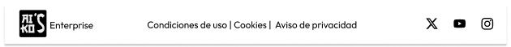
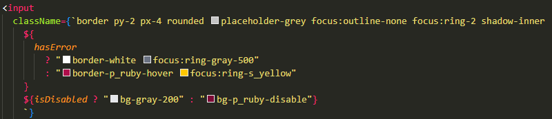

# P5.1 Sistema de Diseño y Componentes React con Tailwind

> **Participantes**: Marcos Alarcón Alguacil y Aitor González Barrera  
> **Curso**: S2DAW  
> **Módulo**: DIW

---
- [P5.1 Sistema de Diseño y Componentes React con Tailwind](#p51-sistema-de-diseño-y-componentes-react-con-tailwind)
  - [Descripción](#descripción)
    - [1. Definir el Sistema de Diseño en Figma](#1-definir-el-sistema-de-diseño-en-figma)
      - [Elección de las fuentes y tipografías](#elección-de-las-fuentes-y-tipografías)
      - [Elección de la paleta de colores](#elección-de-la-paleta-de-colores)
      - [Definición de los componentes básicos](#definición-de-los-componentes-básicos)
    - [2. Exportar el Sistema de Diseño a Tailwind CSS](#2-exportar-el-sistema-de-diseño-a-tailwind-css)
    - [3. Implementar los Componentes en React con TypeScript](#3-implementar-los-componentes-en-react-con-typescript)
    - [Estructura del contenido](#estructura-del-contenido)
      - [1. Carpeta routes](#1-carpeta-routes)
      - [2. Carpeta componentes](#2-carpeta-componentes)
      - [3. Carpeta public](#3-carpeta-public)
  - [Enlaces de interés](#enlaces-de-interés)

## Descripción

En esta práctica, nuestro objetivo es transformar los wireframes diseñados en la práctica anterior en un sistema de diseño bien estructurado dentro de Figma. Posteriormente, exportaremos los estilos a un proyecto en React con TypeScript, utilizando Tailwind CSS para la estilización, asegurando una integración fluida y una apariencia consistente en la aplicación.

### 1. Definir el Sistema de Diseño en Figma

#### Elección de las fuentes y tipografías

- **Fuente**: **Outfit** (Google Fonts). Elegida por su legibilidad y elegancia en distintos tamaños, aportando un toque moderno que armoniza perfectamente con el estilo de la página.

#### Elección de la paleta de colores

- Inicialmente, se consideraron tonos de rosa cerezo, pero finalmente optamos por el **rojo rubí** como color principal, combinándolo con el **dorado** como color secundario. Juntos crean una estética sofisticada y equilibrada.

#### Definición de los componentes básicos

En Figma, hemos diseñado varios componentes esenciales para la implementación en React con TypeScript, garantizando coherencia y eficiencia en el desarrollo:

- **Navbar**
- **Botones** (de diferentes estilos)
- **Acordeón**
- **Formulario**
- **Cards**

---

### 2. Exportar el Sistema de Diseño a Tailwind CSS

- Primero, creamos las variables en Figma y, con el plugin "variables2css", exportamos las variables en formato CSS.
- Luego, las incorporamos en el archivo `tailwind.config.js` para integrarlas correctamente en la configuración de **Tailwind CSS**.

 

- Para instalar la tipografía **Outfit**:
  1. Ejecutamos el comando `npm install @fontsource/outfit`.
  2. La importamos en `home.tsx` con `import "@fontsource/outfit";`, asegurando que la tipografía se cargue correctamente.

---

### 3. Implementar los Componentes en React con TypeScript
- Todos los componenetes definicidos en el figma se encuentrar creados y desplegados en la pagina principal durante el desarrollo de la practica:
  1. ### Logo 
      

        - **Tailwind**:  

            

        - **Variantes**:  

          

  2. ### Footer 
      
       - **Tailwind**: 

           

  3. ### Boton 
      
       - **Tailwind**:

            

        - **Variantes**:  

            
  
  4. ### Header 
      
      
      Cuando se coloca el raton encima del boton de menu:
      
       - **Tailwind**: 
         
            
  
  5. ### Input 
      
       - **Tailwind**: 
       
            

        - **Variantes**:  

          

           1. **Disabled**:
            

           2. **Error**:
                  
  
  6. ### InputDatetime
      
       - **Tailwind**:
         
          
  
  7. ### Textarea 
      
       - **Tailwind**: 
         
           
  
  8. ### Formulario 
      
       - **Tailwind**: 
         
           
  
  9.  ### Card Contacto 
      
       - **Tailwind**: 
         
           
  
  10. ### Card Servicio

      

      Cuando es abierto:
      

      - **Tailwind**:

        

 
---

  ### Estructura del contenido
   #### 1. Carpeta routes
   
   Donde se desplegará las diferentes vistas de la pagina (home, sobre nosotros, contacto, servicios).

  

   #### 2. Carpeta componentes
   
   Donde esta definidos todos los componentes, algunos de ellos son componentes genericos como el input y el boton con los props apropiados
   
  

  - Input:
   
    

  - Boton:
   
    

   #### 3. Carpeta public
   
   Contiene todas las imagenes que se utilizan para la pagina y el readme.
   
  

---

## Enlaces de interés

- [Figma - Sistema de Diseño](https://www.figma.com/design/WDaF51YYjwnqtommMjQDqN/AIKO'S-ENTERPRISE?node-id=0-1&t=PyxuT1d6UFkJ1jrt-1)
- [Página Desplegada](https://aikos-enterprise-sigma.vercel.app/) 
